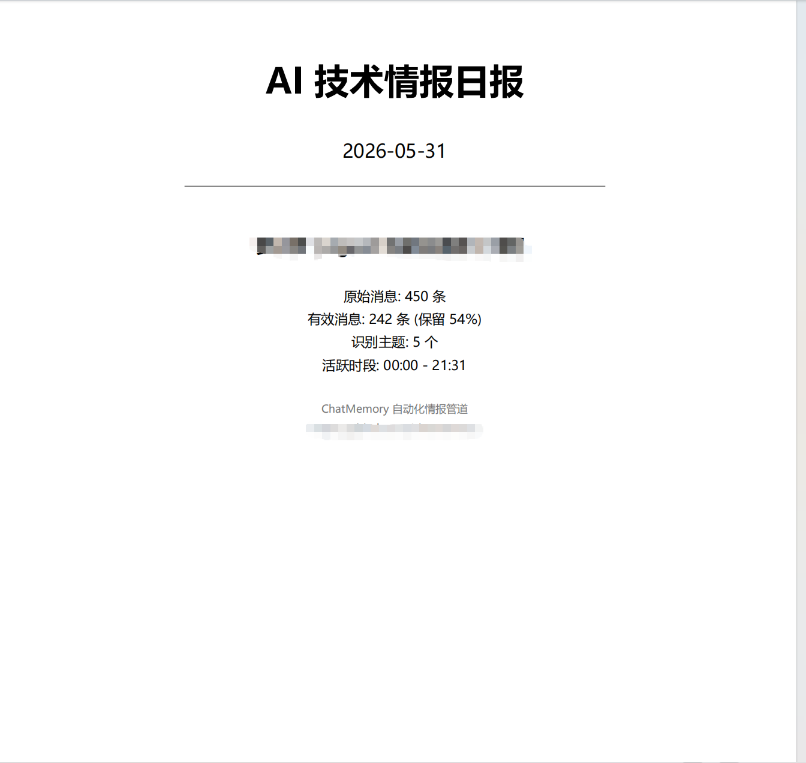

<p align="center">
  
</p>

<p align="center"><em>🎈 六一儿童节快乐！Happy Children's Day! — 也纪念 ChatMemory 插件的诞生 🎂</em></p>

---

# ChatMemory v1.1

<p align="center">
  <strong>微信聊天记录 → 清洗 → NotebookLM 深度分析</strong><br>
  <em>WeChat Chat Record → Clean → AI Intelligence Extraction</em><br>
  <em>Built on WeFlow + Claude Code · Academic Research Tool</em>
</p>

<p align="center">
  <a href="#-快速开始-quick-start">快速开始</a> •
  <a href="TUTORIAL.md">📖 新手教程</a> •
  <a href="#-产出成果-what-it-produces">产出成果</a> •
  <a href="#-管道架构-pipeline">管道架构</a> •
  <a href="#-清洗策略-cleaning-strategy">清洗策略</a> •
  <a href="#-深度分析-deep-analysis">深度分析</a> •
  <a href="#-安装-installation">安装</a> •
  <a href="#️-免责声明-disclaimer">免责声明</a>
</p>

---

## 📦 产出成果 / What It Produces

| 产出 / Output | 格式 / Format | 说明 / Description |
|---------------|---------------|---------------------|
| **每日情报日报** / Daily Briefing | PDF | AI 提炼的每日技术情报日报 / AI-distilled daily tech intelligence briefing |
| **全景周报** / Weekly Panoramic Report | PDF | 一周讨论全景分析，NotebookLM 生成 / Full-week analysis by NotebookLM |
| **专题深度报告** / Deep-Dive Topic Analysis | PDF | 指定关键词的专题深度挖掘 / Deep-dive on specific anchors |
| **思维导图** / Mind Map | JSON | 结构化知识图谱 / Structured knowledge graph |
| **清洗文本** / Cleaned Transcript | TXT | 去噪后可读聊天记录 / Denoised readable transcript |
| **知识卡片** / Knowledge Cards | JSON | 结构化主题知识卡片 (schema v2) / Structured topic knowledge cards |

<p align="center">
  
</p>
<p align="center"><em>▲ 日报 PDF 封面示例 — 包含执行摘要、核心情报和当日主题概览 / Daily Report Cover — Executive Summary, Key Insights & Topic Overview</em></p>

---

## ⚠️ 免责声明 / Disclaimer

### Robots Exclusion Protocol (RFC 9309)

**中文**: 本项目在抓取网页内容时严格遵守 **Robots Exclusion Protocol（机器人排除协议）**。所有 HTTP 请求均以 `chatmemory/1.0` 身份标识，在抓取每个 URL 之前检查目标网站的 `robots.txt`，遵守 `Disallow` 规则和 `Crawl-delay` 指令，绝不伪装浏览器或绕过访问控制。

> **Robots Exclusion Protocol** 是网站与自动化爬虫之间通信的国际标准，规定了网站的哪些部分不应被自动化工具访问。我们无条件遵守这些规则。

**English**: This project strictly adheres to the **Robots Exclusion Protocol** when fetching web content. All HTTP requests identify as `chatmemory/1.0`, check `robots.txt` before fetching every URL, respect `Disallow` rules and `Crawl-delay` directives, and never impersonate a browser or bypass access controls.

### 学术用途声明 / Academic Purpose Statement

**中文**: 本项目基于学术研究目的开发。请负责任地使用：

- ✅ 分析你自己的聊天记录
- ✅ 学术研究中的授权数据处理
- ❌ 未经他人同意抓取其聊天记录
- ❌ 任何违反微信服务条款的行为
- ❌ 大规模自动化数据采集

**使用者须遵守相关法律法规。作者不对任何滥用行为承担责任。**

**English**: This project is developed for academic research purposes. Use responsibly: analyze your own data, process authorized data in research. Do NOT scrape others' records without consent, violate WeChat ToS, or conduct large-scale automated collection. **Users must comply with applicable laws. The author assumes no liability for misuse.**

---

## 🌍 兼容性 / Compatibility

| 组件 / Component | 状态 / Status | 备注 / Notes |
|------------------|---------------|--------------|
| **操作系统** / OS | Windows 专用 | WeFlow 是 Windows 原生应用 (Electron + 微信) |
| **Claude Code** | ✅ 主要支持 | 推荐 v1.0.37 版本，最新版对 DeepSeek 等模型兼容性较差 |
| **Codex** | 🔶 部分支持 | 基础导出/清洗可用，核心深层分析功能依赖 Claude Code + NotebookLM |
| **微信版本** / WeChat | ≤ 4.1.10 | 目前仅支持 4.1.10 及以下版本 |
| **Python** | 3.7+ | 已在 Python 3.13 上测试 |

### Claude Code 版本建议 / Version Recommendation

**中文**: 最新版本的 Claude Code 对 DeepSeek 等第三方模型的兼容性较差。建议使用 **v1.0.37** 版本以获得最佳体验：

```bash
# 安装指定版本的 Claude Code CLI
npm install -g @anthropic-ai/claude-code@1.0.37
```

**English**: The latest Claude Code has poor compatibility with third-party models like DeepSeek. We recommend **v1.0.37** for the best experience.

### 推荐：直接使用 Claude Code 本地适配 / Native Claude Code Setup

**中文**: 我们强烈推荐直接在 Claude Code 中运行本项目——Claude Code 会自动加载 `SKILL.md` 和 `Claude.md` 中的配置，无需手动设置路径。

**English**: We strongly recommend running this project directly within Claude Code — it auto-loads configurations from `SKILL.md` and `Claude.md` without manual path setup.

**中文**: NotebookLM 对访问 IP 有较严格的要求——某些地区的 IP 可能无法正常使用。建议使用与 Google 账号注册地一致的网络环境。

**English**: NotebookLM has strict IP requirements. Some regions may not be able to access it. Use a network environment consistent with your Google account's registered region.

---

## 🚀 快速开始 / Quick Start

### 推荐方式：让 Claude Code 帮你安装 / Let Claude Code Install It

**中文**: 直接对 Claude Code 说：

```
"帮我安装 ChatMemory 插件并完成初始化"
```

Claude Code 会自动：克隆仓库 → 运行初始化脚本 → 安装依赖 → 指导 WeFlow 和 notebooklm 配置。

**English**: Simply tell Claude Code: `"Install the ChatMemory plugin and set it up for me."` It will clone, init, install deps, and guide you through WeFlow + notebooklm setup.

### 手动安装 / Manual Installation

**中文**:
```bash
# 1. 克隆仓库
git clone https://github.com/head-tea/chatmemory.git
cd chatmemory

# 2. 一键初始化（创建目录 + 配置）
python setup.py init

# 3. 安装 Python 依赖
pip install -r requirements.txt
pip install notebooklm-py

# 4. 安装 WeFlow
# 从 GitHub Releases 下载 WeFlow-4.5.1-x64-Setup.exe
# 安装到 E:\chatmemory\tool\WeFlow\

# 5. 设置环境变量
set CHATMEMORY_WEFLOW_TOKEN=你的WeFlow_API_Token

# 6. notebooklm 认证
notebooklm login

# 7. 验证所有依赖就绪
python setup.py check
```

**English**:
```bash
git clone https://github.com/head-tea/chatmemory.git
cd chatmemory
python setup.py init
pip install -r requirements.txt
pip install notebooklm-py
# Download WeFlow from GitHub Releases → install to E:\chatmemory\tool\WeFlow\
set CHATMEMORY_WEFLOW_TOKEN=your_token
notebooklm login
python setup.py check
```

---

## 🔧 管道架构 / Pipeline

```
┌─────────────────────────────────────────────────────────┐
│              WeFlow HTTP API (127.0.0.1:5031)            │
│              微信桌面端 → 聊天数据源                      │
└────────────────────┬────────────────────────────────────┘
                     │  原始 TXT 导出 / Raw TXT export
                     ▼
┌─────────────────────────────────────────────────────────┐
│            6 阶段清洗管道 / 6-Stage Cleaning              │
│  阶段0 解析 Parse → 结构化消息对象                        │
│  阶段1 过滤 Filter → 去表情/图片/寒暄                     │
│  阶段2 合并 Merge  → 碎片拼接 + Q&A 配对                   │
│  阶段3 展开 Expand → URL 内容抓取 (SSRF 防护)              │
│  阶段4 聚类 Cluster → @mention 主题聚合                    │
│  阶段5 输出 Output → 清洗文本 + 知识卡片                    │
│  阶段6 指标 Metrics → 审计报告 + 统计                      │
└────────────────────┬────────────────────────────────────┘
                     │  清洗后文本 / Cleaned transcript
                     ▼
┌─────────────────────────────────────────────────────────┐
│          NotebookLM 深度分析 / Deep Analysis              │
│  inspect → render → upload → weekly / deep / mind-map   │
│  输出: PDF 报告 + JSON 思维导图                            │
└─────────────────────────────────────────────────────────┘
```

---

## 🧹 清洗策略 / Cleaning Strategy

**中文**: 6 阶段清洗管道将嘈杂的群聊数据转化为结构化情报。

| 阶段 | 功能 | 示例 |
|------|------|------|
| **0. 解析** | 从原始 TXT 提取时间戳、发送者、URL、转发文章标题 | `[12:00] 张三: 这篇文章不错` → 结构化消息 |
| **1. 噪声过滤** | 去除表情、图片占位、单字寒暄。**保护问答上下文**：保留对问题的简短回答 | `[OK]`→删除；`过拟合`→保留（技术关键词） |
| **2. 碎片合并** | 2 分钟内同一人的连续短消息拼接 | `"不是""改了之后""会不触发"` → `"不是。改了之后也会不触发"` |
| **3. 链接展开** | 抓取 URL 内容。SSRF 防护 + robots.txt 遵守 | 微信文章 → 标题 + 前 500 字摘要 |
| **4. 主题聚合** | 30 分钟窗口内按 @mention 和关键词聚类 | 5 条散乱消息 → `【主题: Claude Code 记忆系统】` |
| **5. 输出** | 生成清洗文本 + 知识卡片 JSON | 直接上传 NotebookLM |
| **6. 指标** | 统计：保留率、主题数、URL 展开成功/失败 | `450→242 (53.8%), 5个主题, 7张卡片` |

**核心设计理念**:
- 保守去噪：宁留勿删
- 问答保护：不删除对问题的简短回答
- 技术关键词感知："收敛了""batch=32" 不会被删除
- SSRF 安全：DNS 解析 → IP 验证后才发起请求

**English**: The 6-stage pipeline transforms noisy group chat into structured intelligence. Conservative noise removal keeps what matters. Question-context protection keeps short answers. Technical keywords like "converged" or "batch=32" are never removed. SSRF-safe: DNS lookup → IP validation before every fetch.

---

## 🧠 深度分析 / Deep Analysis

**中文**: 清洗完成后，文本送入 Google NotebookLM 进行 AI 深度分析。

### 分析模式

| 命令 | 生成内容 | 适用场景 |
|------|----------|----------|
| `weekly` | 全景周报：主题覆盖、参与者分析、关键洞察 | 团队每周摘要 |
| `deep --anchor "关键词"` | 特定主题的深度挖掘 | 聚焦某个话题的专题研究 |
| `mind-map` | 结构化 JSON 思维导图 | 知识图谱可视化 |

### 工作流程

1. **Inspect** — 扫描可用的已清洗群组及其统计
2. **Render** — 生成 `topic_index.md` + 优化的 AI 提示词
3. **Upload** — 创建 NotebookLM 笔记本，上传数据源（超过 25 万字符自动分块）
4. **Generate** — NotebookLM AI 以 `briefing-doc` 或 `custom` 格式生成报告
5. **Download** — 下载 Markdown → 通过 `fpdf2` 转换为 PDF（支持中日韩字体）

### 蒸馏接口 / Distillation Interface

**中文**: 为了让后来的开发者能够基于本插件的输出结果进行二次创作，我们保留了**蒸馏接口**。清洗后的知识卡片 (`_knowledge_cards.json`) 和清洗文本 (`_cleaned.txt`) 采用开放格式，可以被任何 LLM 或下游工具消费。

```bash
# 直接使用清洗后的数据，不依赖 NotebookLM
python scripts/chatmemory_notebooklm.py weekly --group "群名" --fallback
```

我们欢迎社区基于这套数据格式开发更多分析工具、可视化面板、或接入其他 AI 模型。

**English**: We preserve a **distillation interface** to enable downstream developers to build upon this plugin's outputs. The knowledge cards (`_knowledge_cards.json`) and cleaned transcripts use open formats consumable by any LLM or tool. Community contributions building on this data format — new analysis tools, visualization dashboards, or other AI model integrations — are warmly welcomed.

---

## 📂 项目结构 / Project Structure

```
chatmemory/
├── README.md
├── setup.py                    ← 一键初始化 + 依赖检查
├── config.json                 ← 统一配置
├── cleaning_rules.json         ← 清洗规则定义
├── requirements.txt            ← Python 依赖
├── deps/
│   ├── url-md.exe              ← 微信文章抓取工具
│   └── WeFlow-4.5.1-x64-Setup.exe  ← (GitHub Release 附件)
├── assets/
│   ├── image1.png              ← 🎈
│   └── exemple1.png            ← 产出示例
└── scripts/
    ├── config_loader.py        ← 统一配置入口
    ├── utils.py                ← 共享工具
    ├── wechat_launch.py        ← WeFlow 自动启动
    ├── wechat_export.py        ← HTTP API 导出
    ├── chat_cleaner.py         ← 6 阶段清洗管道
    ├── message_normalizer.py   ← 消息解析器（共享）
    ├── link_expander.py        ← URL 展开（SSRF 安全）
    ├── chatmemory_notebooklm.py ← NotebookLM 深度分析
    └── daily_report.py         ← 日报 PDF 生成
```

---

## 🔒 安全 / Security

| 层面 / Layer | 措施 / Measure |
|-------------|-----------------|
| **Token** | 环境变量 `CHATMEMORY_WEFLOW_TOKEN`，无硬编码回退 |
| **Token 传输** | `Authorization: Bearer` header（绝不在 URL 中传递） |
| **URL 展开** | DNS 解析 → IP 验证 → 拦截 loopback/private/link-local |
| **重定向 SSRF** | 每次重定向跳转前重新验证目标 IP |
| **路径安全** | 所有文件写入限制在项目根目录内 |
| **文件 IO** | `mkstemp` + `os.replace` 原子写入 |
| **文件名** | CON/NUL/PRN 保留名检测 |

---

## ⭐ 项目星标 / Star History

<p align="center">
    <a href="https://star-history.com/#head-tea/chatmemory&Date">
        
    </a>
</p>
<p align="center"><em>▲ 替换 head-tea/chatmemory 为实际仓库路径后即可显示 / Replace with actual repo path</em></p>

---

## 🙏 致谢 / Acknowledgements

- **[WeFlow](https://weflow.app)** — 感谢 WeFlow 团队提供的卓越微信 HTTP API 基础设施，本项目得以在其基础上构建 / for the excellent WeChat HTTP API infrastructure
- **LYQ** — 感谢慷慨的额度支持，使得大规模测试和验证成为可能 / for generous quota support enabling extensive testing
- **[notebooklm-py](https://github.com/teng-lin/notebooklm-py)** — NotebookLM 自动化 CLI 工具
- **[fpdf2](https://github.com/py-pdf/fpdf2)** — 纯 Python PDF 生成库
- **所有贡献者与社区** — 感谢每一位使用和反馈的朋友 / All contributors and the community

---

## 📄 许可证 / License

MIT License — 详见 [LICENSE](LICENSE) 文件。

---

<p align="center">
  <sub>以 ❤️ 为 AI 科研社区构建 · 请负责任使用 · Built with ❤️ for the AI research community · Use responsibly</sub>
</p>
